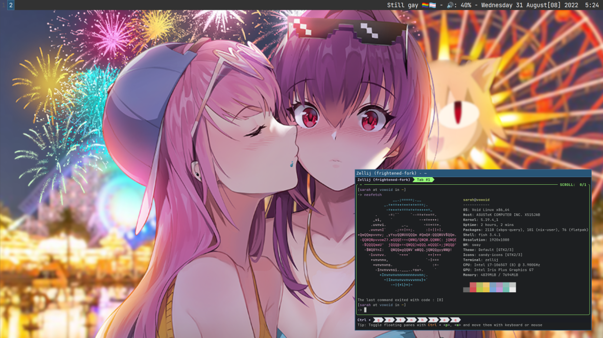

 # Dotfiles

Info :
- OS : [Void Linux](https://voidlinux.org/)
- Kernel : 5.19.4
- WM : [Sway](https://swaywm.org/)
- Terminal : Alacritty
- Shell : Fish 3.4.1
- Terminal multiplexer : [Zellij](https://www.zellij.dev)
- Wallpaper :(old) [link](https://www.pixiv.net/en/artworks/89446377) (new) [link](https://www.pixiv.net/en/artworks/98616585)

