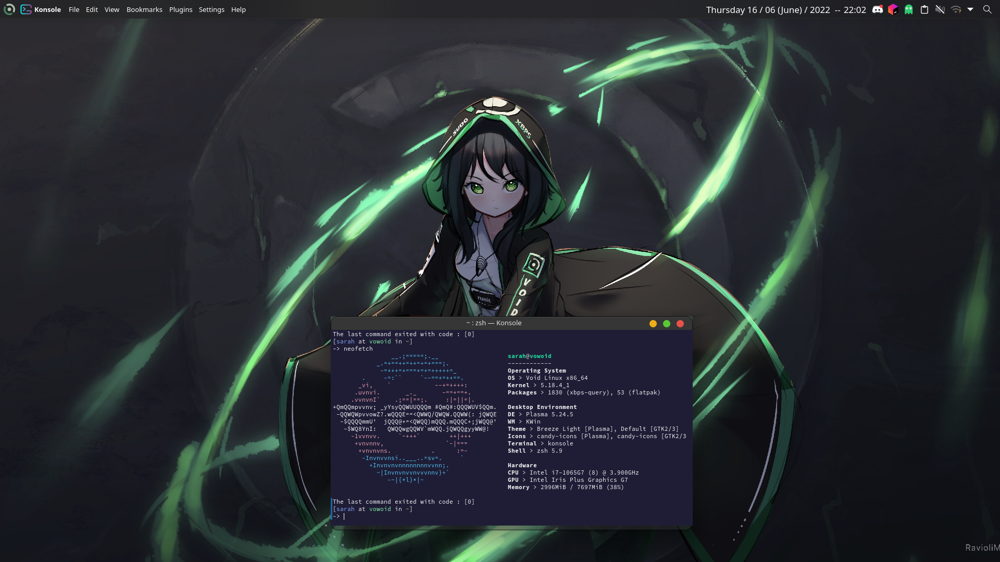

 # Dotfiles

Info :
- OS : [Void Linux](https://voidlinux.org/)
- Kernel : 5.18.4
- DE : [Plasma 5.24.5](https://kde.org/fr/plasma-desktop/)
- WM : KWin
- WM Theme : [Jolly Blue Aurorae]()
- Icons : [candy-icons](https://store.kde.org/p/1305251)
- Cursors : [Sweet Cursors](https://store.kde.org/p/1393084)
- Terminal : Konsole
- Shell : zsh 5.9
- Terminal multiplexer : [Zellij](https://www.zellij.dev)
- Wallpaper :(old) [link](https://www.pixiv.net/en/artworks/89446377) (new) [link](https://www.pixiv.net/en/artworks/98616585)

