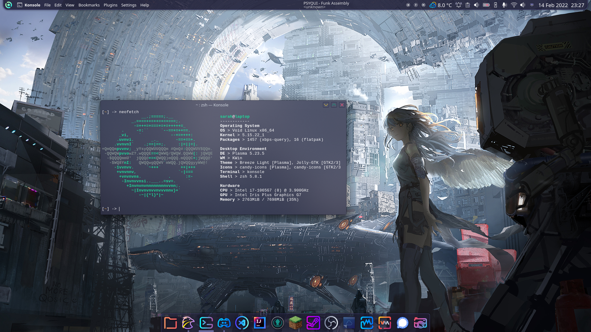

 # Dotfiles

Info :
- OS : [Void Linux](https://voidlinux.org/)
- Kernel : 5.15.17
- DE : [Plasma 5.23.5](https://kde.org/fr/plasma-desktop/)
- Theme : [Jolly](https://www.pling.com/p/1654379/)
- WM : KWin
- WM Theme : [Jolly Blue Aurorae](https://www.pling.com/p/1654353/)
- Icons : [candy-icons](https://store.kde.org/p/1305251)
- Cursors : [Sweet Cursors](https://store.kde.org/p/1393084)
- Terminal : Konsole
- Shell : zsh 5.8
- Wallpaper : [link](https://www.pixiv.net/en/artworks/89446377)

